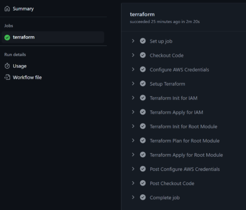
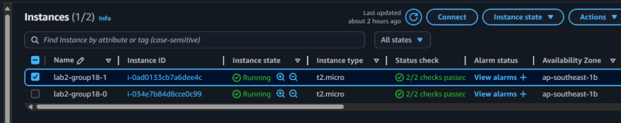
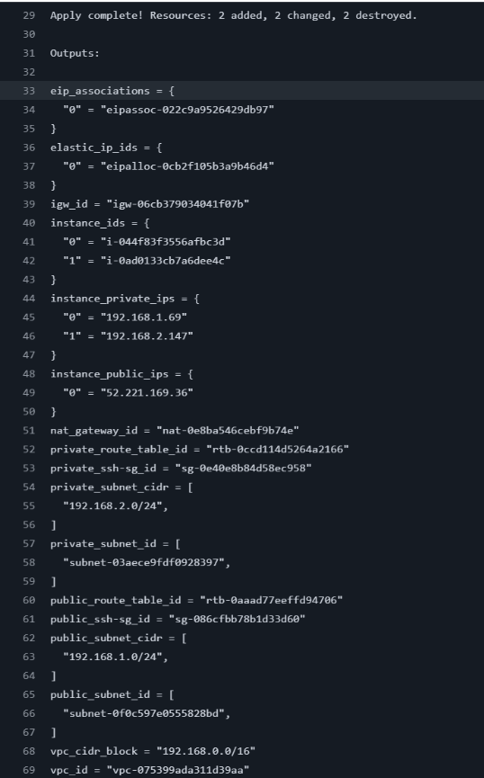
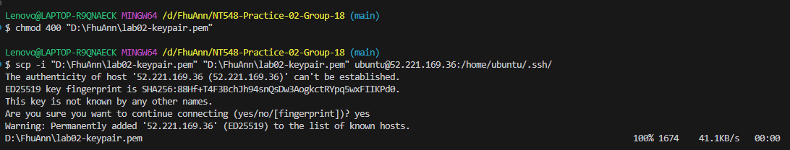
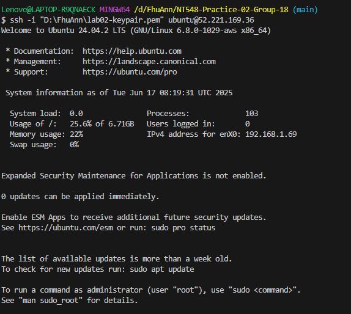
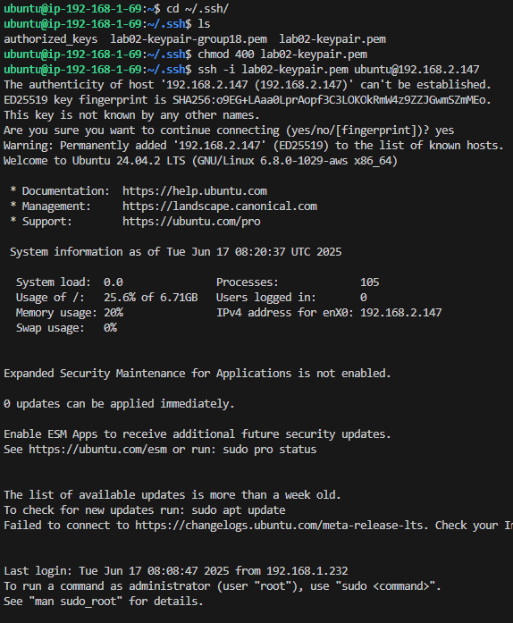

# Terraform Guide

## Prerequisites

1. **Configure AWS credentials**

- You must have the Access key and the Secret Access key of IAM user that has appropriate permissions to deploy AWS infrastructure
- Configure the AWS credentials on your machine using AWS CLI. If you haven't installed AWS CLI before

2. **Create a SSH key pair**

- Create a key pairs at EC2 console, **remember** the name of the key pairs you've just created
- Download the private key (.pem file) and store it securely

3. **Store the private key at AWS Secrets Manager**

- Go to AWS Console → Secrets Manager → Store a new secret
- Select **Other type of secret**, then paste the contents of the .pem file into the Plaintext field.
- Give the secret a name (e.g., ssh-key/my-ssh-key)
- Click Next, leave the default options for the following steps, and finish by clicking Store secret
- Result: You now have a secret containing the private key, with an ARN like...

## Steps to Run the Source

1. **Clone the Repository**

   ```sh
   git clone https://github.com/FhuAnn/NT548-Practice02-Group18-P1-Terraform-GitHubActions.git
   cd terraform
   ```

2. **Modify the variable**

- Direct to the root module folder (Terraform folder):

  ```sh
  cd ..
  cd ..
  ```

- Modify the **default** section at **variables.tf** file _(read description at variables.tf file for details)_ as your demand

- Modify in **main.tf** in root module and **iam/main.tf**

  ```yml
      terraform {
      backend "s3" {
      bucket         = "lab02-terraform-state-group18" # Replace your bucket name
      key            = "iam/terraform.tfstate"
      region         = "ap-southeast-1"
      use_lockfile = true
  ```

- You must also change to the name of you \*\*key pairs and secret too

  ```yml
      ...
      subnet_id              = null
      user_data_file         = "user-data.sh"
      key_name               = "lab02-keypair" # ssh key pair name
      associate_elastic_ip   = true # need assign elastic ip or not
      iam_instance_profile   = "ec2-role-instance-profile"
      ...
      key_name               = "lab02-keypair" # ssh key pair name
      associate_elastic_ip   = false #
      iam_instance_profile   = null #
      ...
  ```

- Replace cidr_block by you your local machine public IP

  ```yml
  ### Variables for Security Group module
  variable "cidr_block" {
  description = "Public IP from Internet that has permission to access the EC2 instance in public subnet, access https://ifconfig.me to know"
  type        = string
  default     = "171.243.49.68/32" #Change your public IP from internet
  ```

- **DO NOT** modify the **vpc_security_group_ids** and **subnet_id** value (null)

3. Configure environment variables (**AWS_ACCESS_KEY_ID** and **AWS_SECRET_ACCESS_KEY**) in repository :

   ```sh
       Settings > Secrets and Variables > Action > New repository secret
   ```

4. **Push changes to repository **

   ```sh
       git add .
       git commit -m “modify variables, keypair name, s3 backend”
       git push origin main
   ```

5. Watch the workflow result (Actions Tab)

   

   If the workflow completes successfully, you will see the deployment results reflected in your AWS.



## Steps to SSH to Instances

- After apply all nested module, tab Actions in repository, you will see an output similar to the one below:

  

- Take a look at the **instance_private_ips** and **instance_public_ips** section, these are the IPs of the instances you have just created. In my example, these IPs are:
  - **instance_private_ips**: 192.168.1.232 (private IP of public instance), 192.168.2.147 (private IP of private instance)
  - **instance_public_ips**: 52.221.169.36 (public IP of public instance)


**1. SSH to public instance**

- Locate your private key file (.pem)
- Run this command, if necessary, to ensure your key is not publicly viewable

```sh
chmod 400 <private-keypair-file>
```

- Copy <your-keypair-file>.pem to public instance

```sh
    scp -i <private-keypair-file>  <private-keypair-file> ubuntu@<public-ip>:/home/ubuntu/.ssh/
```

- Connect to your instance using its public IP

```sh
    ssh -i <private-keypair-file> ubuntu@<public-ip>
```

**2. SSH to private instance**

- You need to SSH to the public instance first, follow the above instruction
- On public instance:

```sh
    cd ~/.ssh
    ls #To show files in current path
```

- SSH to private instance:

```sh
ssh -i <private-key-file> <username>@<private-ip>
```

- The result you can see:






